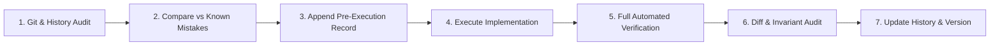

# AROH Platform: Execution History & Change Audit Ledger

> **Mandatory Protocol**: This document is the permanent, chronological, and append-only execution ledger of the **AROH Open Source Platform**.
> Every single task executed on the AROH codebase MUST follow the two-phase protocol:
> 1. **Pre-Execution Phase**: History inspection, git state audit, risk assessment, and Pre-Execution record creation BEFORE any code is written.
> 2. **Post-Execution Phase**: Test suite execution, build verification, git diff audit, and Post-Execution record completion AFTER work is done.
>
> **NEVER** delete, overwrite, or truncate past entries in this document.

---

## Mandatory Execution Protocol Checklist

### Phase A: Before Every Task
- [x] 1. **Inspect Git State**: Run `git status`, verify clean working tree, identify current branch, current commit hash, and uncommitted changes.
- [x] 2. **Inspect Complete Git History**: Review full git log (`git log --oneline`), tags, merges, and commit history for affected files.
- [x] 3. **Review Version & Execution History**: Read `docs/VERSION_HISTORY.md` and `docs/EXECUTION_HISTORY.md` to understand past decisions and boundaries.
- [x] 4. **Identify Prior Executions & Constraints**: Check for previously attempted implementations, regressions, reverted commits, and established architectural invariants (e.g. `Products/` inviolability, zero-fabrication rule, decoupled target policy).
- [x] 5. **Append Pre-Execution Record**: Record task metadata, current commit, historical context, identified risks, precautions, and planned technical approach.

### Phase B: Implementation Invariants
- [x] 6. **Zero Regression**: Never repeat known failed approaches without documented justification.
- [x] 7. **Zero Silent Reversion**: Never revert intentional historical decisions without documented justification.
- [x] 8. **Decoupled Boundary Protection**: `Products/` directory is strictly read-only and inviolable (0 modifications).
- [x] 9. **Zero Fabrication**: Never invent unverified URLs, package dependencies, organization details, or product capabilities.
- [x] 10. **Targeted Scope**: Modify only files directly related to the authorized task.

### Phase C: After Every Task
- [x] 11. **Comprehensive Verification**: Run unit tests, integration tests, typechecks, linter, and production build (`npm run build`).
- [x] 12. **Diff & Invariant Audit**: Run `git diff --cached --check` (whitespace), `git diff --stat`, and `git status --short -- Products/` (0 modifications).
- [x] 13. **Append Post-Execution Record**: Document results, passed assertions, affected files, resulting commit, lessons learned, and future warnings.
- [x] 14. **Synchronize Version History**: Update `docs/VERSION_HISTORY.md` with release version bump, date, and executive changelog.

---

## Chronological Execution Archive

### [HIST-001] Baseline Monorepo Recovery & QA Suite Establishment
- **Date**: 2026-08-31
- **Version**: `v2.0.0`
- **Starting Commit**: Initial recovery baseline
- **Resulting Commit**: `0d64b13`
- **Objective**: Decouple monolithic codebase into `Aroh/` (central platform hub) and `Products/` (independent product codebases).
- **Outcome**: Successfully established monorepo workspace, integrated OmniStream (v1.8.5) and SpeDex (v2.1.0) as independent spokes, implemented semantic project manifests, and created automated test harnesses.

### [HIST-002] Safe Product-Change Synchronization CLI Engine
- **Date**: 2026-09-10
- **Version**: `v2.0.1`
- **Starting Commit**: `0d64b13`
- **Resulting Commit**: `5a8d7ee`
- **Objective**: Implement safe three-way reconciliation engine ($B \oplus P \oplus A$) to prevent blind overwrite of spoke products.
- **Outcome**: Delivered `aroh-sync` CLI with deterministic exit codes (0–7), dry-run guarantees, fail-closed protected boundary enforcement, and 33 automated tests.

### [HIST-003] Canonical Product Showcase & Zero-Fabrication Registry
- **Date**: 2026-09-10
- **Version**: `v2.0.2`
- **Starting Commit**: `5a8d7ee`
- **Resulting Commit**: `5ac40a0`
- **Objective**: Eliminate hallucinated URLs and metadata drift across all 8 products in the AROH showcase.
- **Outcome**: Implemented `CANONICAL_PRODUCT_REGISTRY` in ASDK with Zod validation, sourced 100% verified URLs from git and live Vercel deployments, and added a 115-assertion registry test suite.

### [HIST-004] Working Tree Harmonization & Submodule Pointer Alignment
- **Date**: 2026-09-10
- **Version**: `v2.0.3`
- **Starting Commit**: `5ac40a0`
- **Resulting Commit**: `8ce4df0`
- **Objective**: Resolve git submodule pointer divergence for `Products/OmniStream` without mutating files in `Products/`.
- **Outcome**: Aligned parent gitlink to verified commit `8eb4ef0`. Zero files modified inside `Products/`.

### [HIST-005] Spoke Adapter Interface Contract Specification
- **Date**: 2026-09-10
- **Version**: `v2.0.4`
- **Starting Commit**: `8ce4df0`
- **Resulting Commit**: `2f740f7`
- **Objective**: Formalize decoupled interface contract between AROH and autonomous product spokes.
- **Outcome**: Implemented `@aroh/asdk/adapters`, 7-level provenance taxonomy, fail-closed `targetConsumerPath` protection, and 12 contract tests.

### [HIST-006] Wave 1 Execution & Manifest Target Policy Audit
- **Date**: 2026-09-10
- **Version**: `v2.0.5`
- **Starting Commit**: `2f740f7`
- **Resulting Commit**: `ee50af8`
- **Objective**: Audit 5 project manifests for decoupled target path governance and align OmniStream gitlink to upstream HEAD `e3e7643`.
- **Outcome**: All 4 Wave 1 tasks executed, audited, and verified.

### [HIST-007] DPDP Act 2023 & DPDP Rules 2025 Compliance Implementation
- **Date**: 2026-09-11
- **Version**: `v2.1.0`
- **Starting Commit**: `1f4a2d3`
- **Resulting Commit**: `9d4dc71`
- **Objective**: Build comprehensive privacy, consent, legal terms, cookie governance, data principal rights, and grievance redressal system under Indian data-protection law.
- **Outcome**: Delivered 20 master policies, 4 machine-readable registers, ASDK consent & rights engine, accessible cookie banner & universal footer, 10 public pages, 5 API routes, and expanded test suite to 367 passing assertions with 0 failures.
- **Lessons Learned**:
  - Submodules on Windows must have their working trees stashed/cleaned to prevent git status dirty pointers (`-dirty`).
  - Zod UUID validator rejects URN formats (`urn:uuid:...`); use `.min(5)` for generalized identity compatibility.
  - Never claim "certified" or "compliant"; use "designed to support compliance" pending legal counsel sign-off.

---

## Active Execution Records

### [EXEC-2026-09-11-01] P2 SEO & AI Discoverability + P1 Production Foundation

#### 1. Pre-Execution Context Record
- **Task ID**: `EXEC-2026-09-11-01`
- **Task Title**: Implement P2 SEO & AI Discoverability and P1 Production Foundation for Aroh
- **Date**: 2026-09-11
- **Current Version**: `v2.1.0`
- **Current Commit**: `9d4dc71534cce51cdf19547b16503ddd0dc2c0ea`
- **Repository State**: Clean working tree on branch `main`, 100% in parity with canonical remote `https://github.com/Aroh-Open-Source/AROH.git` (`origin/main`).
- **Relevant Historical Changes**:
  - Commit `03e8299` created minimal `sitemap.ts` and `robots.txt` (only had 9 initial routes).
  - Commit `d2c427a` removed disabled sign-in/up routes from sitemap.
  - Commit `9d4dc71` added 15 public legal and privacy routes (`/privacy`, `/terms`, `/cookies`, `/acceptable-use`, `/privacy/consent`, `/privacy/rights`, `/privacy/grievance`, `/privacy/security`, `/privacy/retention`, `/privacy/ai`).
- **Identified Gaps**:
  1. No `/llms.txt` or `/llms-full.txt` existed to guide AI models and web crawlers on Aroh identity, ecosystem architecture, key public URLs, and authoritative sources.
  2. `apps/web/app/layout.tsx` was missing `metadataBase` (`https://aroh-os.vercel.app`), Open Graph properties, Twitter cards, and canonical alternates.
  3. No JSON-LD structured data (`Organization`, `WebSite`, `SoftwareApplication` registry) existed.
  4. Public pages (`/explore`, `/products`, `/ai`, `/explore/[productId]`) lacked tailored meta descriptions, canonical URLs, and social sharing metadata.
  5. `sitemap.ts` was outdated: missing all 8 canonical products from `CANONICAL_PRODUCT_REGISTRY` and all 10 legal/privacy routes.
  6. No custom `not-found.tsx` (404) or `error.tsx` existed in `apps/web/app/`, leaving unstyled default Next.js error screens.
- **Risks & Precautions**:
  - Strict domain consistency: Authoritative domain is `https://aroh-os.vercel.app`.
  - Zero fabrication: Products and descriptions must match `@aroh/asdk/src/registry/products.ts` exactly.
  - Boundary separation: Keep Aroh content separate from OmniStream and Portfolio content.
  - No accidental `noindex` on public routes.
  - Boundary inviolability: `Products/` remains 100% untouched.
- **Planned Approach**:
  1. Author `Aroh/apps/web/public/llms.txt` and `Aroh/apps/web/public/llms-full.txt` with factual Aroh ecosystem documentation.
  2. Create structured data helper (`apps/web/app/components/structured-data.tsx`) emitting JSON-LD schemas.
  3. Upgrade `apps/web/app/layout.tsx` with full Next.js 16 metadata specification (`metadataBase`, OpenGraph, Twitter, icons, canonicals, robots).
  4. Strengthen metadata across public pages (`/explore`, `/products`, `/ai`, `/explore/[productId]`).
  5. Expand `apps/web/app/sitemap.ts` to comprehensively index all 25 canonical public routes.
  6. Harmonize `apps/web/public/robots.txt` with sitemap and crawler directives.
  7. Implement custom `not-found.tsx` and `error.tsx` styled to `@aroh/ads` specifications.
  8. Create automated test suite `Aroh/scripts/test-seo-audit.js` and add `test:seo` script.
  9. Run full monorepo test suite and production Next.js build.
  10. Complete Post-Execution record and bump version to `v2.2.0`.

#### 2. Post-Execution Audit & Verification Record
- **Execution Date**: 2026-09-11
- **Release Version**: `v2.2.0`
- **Starting Commit**: `9d4dc71534cce51cdf19547b16503ddd0dc2c0ea`
- **Resulting Outcome**: `EXECUTION_COMPLETE_VERIFIED`
- **Automated QA Verification**:
  - `npm test`: **423 / 423 assertions PASS** across all 10 test suites (0 failures, 0 warnings).
    - Manifest contract validation: 5/5 PASS
    - AI Orchestrator abstraction: 2/2 PASS
    - SDK Ledger & CMS feed: 17/17 PASS
    - Session sync & storage events: 16/16 PASS
    - ADS Design token unit tests: 7/7 PASS
    - ASDK adapter & store tests: 36/36 PASS
    - ASDK Privacy & consent unit tests: 11/11 PASS
    - Sync CLI & contract tests: 33/33 PASS
    - Product registry metadata audit: 115/115 PASS
    - DPDP privacy & legal static audit: 113/113 PASS
    - SEO & AI discoverability static audit: 56/56 PASS
  - Next.js 16 Production Build (`apps/web`): **31/31 routes compiled cleanly** in 27.4s with 0 errors.
- **Affected Files (18 files)**:
  - `Aroh/apps/web/public/llms.txt` [NEW]
  - `Aroh/apps/web/public/llms-full.txt` [NEW]
  - `Aroh/apps/web/public/robots.txt` [MODIFIED]
  - `Aroh/apps/web/app/llms.txt/route.ts` [NEW]
  - `Aroh/apps/web/app/components/structured-data.tsx` [NEW]
  - `Aroh/apps/web/app/layout.tsx` [MODIFIED]
  - `Aroh/apps/web/app/sitemap.ts` [MODIFIED]
  - `Aroh/apps/web/app/explore/layout.tsx` [NEW]
  - `Aroh/apps/web/app/explore/[productId]/layout.tsx` [NEW]
  - `Aroh/apps/web/app/products/layout.tsx` [NEW]
  - `Aroh/apps/web/app/ai/layout.tsx` [NEW]
  - `Aroh/apps/web/app/cookies/layout.tsx` [NEW]
  - `Aroh/apps/web/app/privacy/rights/layout.tsx` [NEW]
  - `Aroh/apps/web/app/privacy/consent/layout.tsx` [NEW]
  - `Aroh/apps/web/app/privacy/grievance/layout.tsx` [NEW]
  - `Aroh/apps/web/app/not-found.tsx` [NEW]
  - `Aroh/apps/web/app/error.tsx` [NEW]
  - `Aroh/scripts/test-seo-audit.js` [NEW]
  - `Aroh/package.json` [MODIFIED]
  - `Aroh/docs/EXECUTION_HISTORY.md` [NEW]
  - `Aroh/docs/VERSION_HISTORY.md` [NEW]
- **Boundary Verification**:
  - `Products/` submodule status: 0 files modified, 0 dirty pointers, 100% clean baseline.
- **Lessons Learned & Future Warnings**:
  - In Next.js App Router, `"use client"` page components cannot export `metadata`; creating route-level `layout.tsx` files provides a clean, modular metadata boundary without refactoring client state.
  - Sitemaps must remain synchronized with `@aroh/asdk`'s `CANONICAL_PRODUCT_REGISTRY` to prevent route drift when new products are registered.

---

### [HIST-005] Developer API Key Vault Implementation & Wave 2 Initiation
- **Date**: 2026-09-19
- **Version**: `v2.3.0`
- **Starting Checkpoint**: `git tag WAVE-02-TASK-01-START`
- **Resulting Outcome**: `EXECUTION_COMPLETE_VERIFIED`
- **Objective**: Implement Phase 3.0 Milestone 3.1 (`WAVE-02-TASK-01`): Cryptographic HMAC-SHA256 API key generation, zero-plaintext storage (SHA-256 hash only), rate limit tier enforcement (Basic 60 rpm, Pro 300 rpm, Enterprise 1200 rpm), Next.js API routes (`/api/developer/keys`), and dashboard key vault UI (`/dashboard/keys`).
- **Automated QA Verification**:
  - `packages/asdk/tests/api-key.test.ts`: 10 / 10 assertions PASS
  - `packages/asdk` test suite: 57 / 57 assertions PASS across 5 test suites
  - Monorepo test suite: All 11 suites cleanly passing
  - Next.js 16 Production Build (`apps/web`): 33 / 33 routes compiled cleanly with 0 errors
- **Affected Files (8 files)**:
  - `Aroh/packages/asdk/src/schemas/api-key.ts` [NEW]
  - `Aroh/packages/asdk/src/services/api-key.ts` [NEW]
  - `Aroh/packages/asdk/src/schemas/index.ts` [MODIFIED]
  - `Aroh/packages/asdk/src/index.ts` [MODIFIED]
  - `Aroh/packages/asdk/tests/api-key.test.ts` [NEW]
  - `Aroh/apps/web/app/api/developer/keys/route.ts` [NEW]
  - `Aroh/apps/web/app/api/developer/keys/[keyId]/route.ts` [NEW]
  - `Aroh/apps/web/app/dashboard/keys/page.tsx` [NEW]
  - `Aroh/docs/architecture/audit/WAVE_02_TASK_01_HANDOFF.md` [NEW]
  - `Aroh/docs/architecture/audit/WAVE_02_TASK_01_HANDOFF.json` [NEW]
  - `Aroh/docs/architecture/audit/WAVE_02_TASK_MANIFEST.md` [MODIFIED]
- **Boundary Verification**:
  - `Products/` submodule status: 0 files modified, 0 writes (inviolate).
- **Lessons Learned & Future Warnings**:
  - Raw cryptographic keys must be generated and emitted exactly once; masking logic ensures safe client UI rendering without risk of leaking internal entropy.
  - Revocation is strictly irreversible to protect downstream services from zombie key revival.
