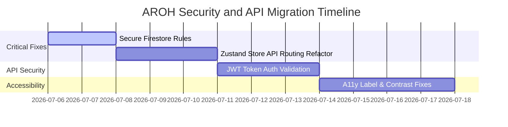

# AROH Ecosystem Platform - Master Audit, Gap Analysis & Perception Report (v1.1)

This report combines the complete engineering due-diligence audit, project understanding/perception analysis, and a detailed phase alignment comparison of the AROH Ecosystem Platform.

---

# SECTION A: PROJECT UNDERSTANDING & PERCEPTION ANALYSIS

## PART 1 — FIRST IMPRESSION

### What is this product?
Based on the repository, codebase, and documentation, **AROH** is a monorepo-based ecosystem platform designed to run a suite of interconnected applications. Its core features revolve around a centralized financial system (the **Aros Wallet**), a shared user role and profiles database, and a centralized content management service (the **CMS Alerts**). Currently, the active application is a Next.js web application (`apps/web`) acting as the platform entry hub, supported by shared local packages:
1. `@aroh/ads` (Aroh Design System) providing a unified component library.
2. `@aroh/asdk` (Aroh Software Development Kit) managing common schemas, state, and Firebase database clients.

### What problem does it solve?
AROH solves the fragmentation problem that typical multi-product ecosystems face. Instead of rebuilding authentication, user profiles, transactional ledgers, design systems, and notifications for each individual app, AROH provides a centralized "Platform Foundation" (SSOT) where these resources are defined once and inherited by all secondary applications. It enables solo developers or small teams to scale multiple products rapidly while keeping overhead extremely low.

### Who is the target audience?
The target audience consists of:
1. **End Users:** Users participating in the AROH ecosystem who utilize the Aros token economy, subscribe to memberships, and use various interconnected productivity/financial services.
2. **Developers (Ecosystem Partners):** Developers building products that run inside the AROH ecosystem using the Aroh SDK (`@aroh/asdk`) and Design System (`@aroh/ads`).
3. **Platform Operators:** Administrators and content managers who configure alerts, manage features, and audit ledger transactions.

### What is the primary value proposition?
**"Create once, use everywhere."** By centralizing core functions (Auth, profile, Aros Wallet ledger, design system tokens), AROH provides an instant, unified foundation for any new application launched within its workspace, saving hundreds of hours of redundant development and ensuring consistent user sessions, styling, and financial integrity across the entire suite.

### What industry does it belong to?
AROH belongs to **Software Infrastructure / Developer Tools / Web3 & Tokenized SaaS Ecosystems**. It blends tokenized micro-economy (Aros token) with enterprise SaaS architecture (multi-tenant or multi-app monorepos).

### What are its core features?
1. **Aros Core Wallet:** A ledger-backed wallet that records transactions (charges, rewards, refunds, membership upgrades) to ensure financial integrity.
2. **Unified Authentication & Identity:** Standardized login, registration, and email verification with role-based access control (Admin, Operator, User) shared via ASDK.
3. **Aroh CMS Alerts:** Dynamic announcement system on the homepage allowing publishing, drafting, categorizing (info, promotion, maintenance), and editing updates.
4. **Membership Tier System:** A three-tier subscription model (Basic, Pro, Enterprise) purchased using Aros tokens.
5. **Shared Packages Architecture:** Monorepo using npm workspaces where `@aroh/ads` manages UI components and `@aroh/asdk` manages schemas, global state, and data clients.

### What appears to be the long-term vision?
The long-term vision (per `Doc 01` AROH Constitution and `Doc 11` Architecture Overview) is to scale from a single web dashboard to a vast connected ecosystem containing multiple web applications, native mobile apps, desktop apps, and third-party plugins. All of these will tap into a single source of truth for auth, state, and transaction ledgers, utilizing Aros as the universal utility token.

### What is the perceived maturity level?
The project is in its **Phase 1 MVP (Minimum Viable Product)** stage. While the monorepo architecture, design system modules, database rules, and build pipeline are fully operational, the core logic relies on a local storage simulation (Mock DB) which dynamically switches to a real Firebase client if credentials are provided. There are no production integrations, real payment gateways, or secondary products implemented yet.

### What type of company or developer would build this?
An experienced **System Design Architect / Full-Stack Engineer** with strong monorepo and serverless systems expertise. The code shows strict compliance with clean architecture, strict TypeScript typing, layout-logic decoupling, and governance rules. It was engineered specifically to be highly maintainable by a solo developer operating with AI-assist tools.

---

## PART 2 — PROJECT UNDERSTANDING

### The Ecosystem Architecture
The AROH Ecosystem is structured as a **Monorepo** managed via npm workspaces. It separates apps from packages to enforce code reuse and logical boundaries. 
* **`apps/web` (Next.js 15+ App Router):** The main entry platform. It presents the landing interface, login gate, user dashboard (membership selector and ledger table), CMS alert manager, and the administrator rewards console.
* **`packages/ads` (Aroh Design System):** The visual foundation containing Tailwind-styled UI elements (e.g., custom `Button` component) and styling tokens.
* **`packages/asdk` (Aroh Software Development Kit):** The core intelligence package. It contains:
  * **Schemas:** Zod-based models for Profiles, Wallets, Transactions, and Announcements.
  * **Services:** A Firebase client interface that automatically falls back to an in-memory/localStorage mock database if environment configurations are absent.
  * **Store:** A global Zustand store implementing actions like authentication, wallet upgrading, user rewarding, and CMS CRUD operations.

### Relationships and Navigation
Products are unified under a single user identity. The user signs in once at `/login`, which updates the global Zustand store with their `user`, `profile`, and `wallet` records. The dashboard (`/dashboard`) acts as the user control center. Depending on the user's role (Admin or Operator), they are granted access to administrative panels (`/admin` and `/cms`). Currently, navigation is achieved using standard client-side Next.js routing within the same web application, but the structure is pre-configured to export modules that can be consumed by other apps.

### The Business Model
The business model is a **tokenized membership economy**. Users start with a base balance (e.g., 500 Aros) and must spend these tokens to upgrade to higher membership tiers:
* **Basic Access:** 0 Aros. Includes basic capabilities (read announcements, standard search, single profile).
* **Developer Pro:** 100 Aros. Unlocks wallet ledger audit tools and 5GB asset storage.
* **Platform Enterprise:** 500 Aros. Unlocks CMS editorial privileges, unlimited asset storage, and developer SDK overrides.
In a production setting, users would purchase Aros tokens with fiat currency, making Aros the fuel for unlocking platform tiers and consuming shared services.

### AI and Developer Integration
AI is treated as a first-class engineering accelerator. The repository contains extensive prompt frameworks (`Phase - 0/Prompts` and `Phase - 1/` directories) defining exactly how autonomous coding assistants must interact with the codebase. The long-term vision includes a "Shared AI" service that will consume the platform data models to provide automated user assistance and developer generation tasks.

### Evidence of Shared Platform and Design Language
There is clear, structured evidence:
* **Shared SDK (`@aroh/asdk`):** Next.js uses transpilation packages configuration (`transpilePackages: ["@aroh/ads", "@aroh/asdk"]` in `next.config.ts`) to directly consume ASDK. The frontend uses `usePlatformStore` to retrieve all state, auth details, and functions.
* **Shared Design Language (`@aroh/ads`):** Next.js imports custom `@aroh/ads` buttons. The styling is defined using a consistent color theme: a custom dark background `#0a0a0c`, standard typography (Outfit font via `next/font/google`), and micro-interactions powered by `framer-motion`.

---

## PART 3 — PRODUCT STORY

**What is Aroh?**
Aroh is a premium, unified digital platform containing multiple interconnected applications running on a centralized database, identity framework, and token economy.

**What does Aroh do?**
Aroh provides a secure foundation for launching, managing, and auditing web services. It integrates user authentication, profile details, dynamic CMS notifications, a membership tier system, and a transaction-based wallet economy into a single workspace.

**Why would someone use it?**
A developer would use Aroh to launch multiple applications without writing boilerplate code for login, design elements, state management, or billing. An end user would use Aroh to access a suite of developer and analytics tools using a single wallet balance and unified credentials.

**What makes it different?**
Unlike traditional platform setups where each app maintains its own user record, database connections, and styles, Aroh achieves absolute Single Source of Truth (SSOT). An update to a user's profile, role, or wallet balance instantly syncs across the entire workspace, preventing logical duplicates and state drift.

**What stage of development does it appear to be in?**
Aroh is in its Phase 1 MVP bootstrap phase. The architectural skeleton is complete, and a mock testing suite verifies logic correctness. However, it lacks external API integrations, production payment gateways, and real application workloads beyond the core web dashboard.

---

## PART 4 — BRAND CLARITY

A first-time visitor to the homepage will find a high-quality presentation:
* **What Aroh is:** A unified ecosystem of digital services.
* **What Aroh is not:** It is not an open-source framework or a generic website; it is an integrated platform workspace.
* **Branding Consistency:** The visual identity is highly consistent, utilizing the Outfit font family, a dark tech aesthetic (`#0a0a0c`), sleek gradient borders, amber/gold accents (`from-amber-400 to-amber-500`), and smooth hover/tap scaling effects on elements.
* **Ambiguity:** Despite the professional layout, the copy uses highly abstract technical terms (e.g., "centralized financial engine," "instant ledger clearance," "developer SDK overrides"). A non-technical visitor might not immediately understand what actual software applications they can run here. The homepage showcases a product catalog ("Aros Core Wallet", "Aroh CMS Alerts", "Aros Metrics Engine"), but clicking them simply redirects the user to sign in or view the dashboard. There are no standalone application features implemented yet.

---

## PART 5 — EXPECTATION VS REALITY

### Expectations Created
The homepage promises a **"premium, unified digital platform containing multiple interconnected products sharing a centralized foundation."** It showcases an intro video, dynamic live announcements, and an ecosystem index containing three products (Wallet, CMS Alerts, Metrics Engine).

### The Reality
* **Dashboard Redirects:** When the user enters the workspace, they are presented with a unified dashboard. Instead of three separate applications, they see a single page that lets them update their membership, view their wallet, and see ledger logs.
* **Metrics Engine is Missing:** While "Aros Metrics Engine" is listed on the homepage, there is no corresponding application or route for it. The metrics charts do not exist in the dashboard page.
* **Auth Verification Warning:** The system shows an email verification banner, but since it is running in mock mode, clicking "Send Verification" prints a simulated message to the console instead of sending an actual email.
* **Ecosystem Connection:** The connection between products is currently simulated. There are no other actual application routes, making the platform feel like a single dashboard rather than an ecosystem of multiple tools.

---

## PART 6 — IDENTITY ALIGNMENT

The product's perceived identity is a **Developer Platform and Software Ecosystem**.
It does not present itself as a simple personal portfolio because it has complex database models, role-based controls, ledger tables, and automated testing scripts. It is structured like a startup product in its initial MVP phase:
1. It establishes the central core (Identity, Wallet, CMS).
2. It organizes codebase modules into reusable npm packages.
3. It outlines developer guidelines, security rules, and a constitution for future expansion.
It acts as the architectural blueprint for a large-scale platform, waiting for real workloads (Phase 2) to be connected.

---

## PART 7 — EXTERNAL PERCEPTION

### First-Time User
* **Perception:** A modern web app with a highly polished design.
* **Impression:** The intro video, transitions, and dark UI feel premium.
* **Confidence:** High confidence in the design quality, but confused as to what the app actually does since there are no active tools besides buying upgrades with mock tokens.
* **Questions:** "How do I earn Aros tokens?" "Where is the Metrics Engine?"

### Technical Recruiter / Hiring Manager
* **Perception:** A highly structured, professional monorepo demonstrating enterprise engineering practices.
* **Impression:** Decoupled packages, TypeScript typing, and automated testing are impressive for an MVP.
* **Confidence:** Very high confidence in the developer's engineering hygiene, structure, and system design capability.
* **Questions:** "Why are we writing data client-side instead of using API routes?" "Is this configured for production deployment?"

### Software Architect
* **Perception:** A classic monorepo using Next.js App Router and Zustand.
* **Impression:** Clear separation of visual components (`packages/ads`) and state/services (`packages/asdk`).
* **Confidence:** Moderate-to-high. The architecture is clean, but the direct client-side database calls bypass the API layer, introducing coupling and security risks.
* **Concerns:** "Firestore rules allow the client browser to write directly to wallet balances. This is a severe threat to transaction integrity."

### Startup Founder / Investor
* **Perception:** A proof-of-concept for a tokenized micro-economy platform.
* **Impression:** Looks beautiful, but has no actual utility or monetization logic connected.
* **Confidence:** Low-to-moderate. The foundation is there, but without real products, there is no business value.
* **Questions:** "What is the primary product that drives user acquisition?" "How do you secure Aros token integrity?"

---

## PART 8 — COMMUNICATION GAPS

* **Invisible API Routes:** The backend API routes (`/api/admin/reward` and `/api/health`) are fully operational and validate input schemas using Zod. However, the frontend components bypass these completely and call the mock database directly.
* **Seeded Accounts Hint:** The login page displays demo account credentials (admin, operator, user) in a box at the bottom. This is useful for reviewers, but it breaks the premium portal brand and should be replaced by an interactive demo switcher or a separate sandbox environment.
* **Document Reference Drift:** The `Phase - 0` and `Phase - 1` documents contain detailed specifications, but many lists reference Phase 3 features (like shared AI and global analytics) that are not present, creating confusion about what is currently functional.

---

## PART 9 — FINAL UNDERSTANDING

### Detailed Analysis of the AROH Ecosystem Platform

Based on an exhaustive, file-by-file audit of the repository, the AROH Platform is a monorepo setup designed to support a multi-product ecosystem. 

#### 1. Repository Layout and Workspace Configuration
The workspace utilizes npm workspaces to manage three packages: the core web app (`apps/web`), the design system (`packages/ads`), and the software development kit (`packages/asdk`). The root configuration (`package.json`) manages these dependencies, while typescript definitions are inherited from a central `tsconfig.json`. The setup script `scripts/setup-env.js` ensures development prerequisites are met by enforcing Node.js 18+ and seeding `.env.local` with database credentials.

#### 2. Architecture and Data Flow
The architecture is built around Next.js App Router (React 19) in `apps/web`. It imports styling definitions from `apps/web/app/globals.css` and font configs from Google's Outfit font. 
State management is handled entirely by a central Zustand store inside `@aroh/asdk` (`packages/asdk/src/store/index.ts`). The store manages the authentication status, user session variables, list of announcements, and ledger transaction lists. It exposes actions like `login`, `register`, `logout`, `upgradeMembership`, and `rewardUser`.

Data flows from the frontend components to the Zustand store, which then calls database methods in `packages/asdk/src/services/firebase.ts`. If the database configuration contains valid credentials, these services communicate with Google Firebase Auth and Firestore. Otherwise, the client falls back to a simulated storage mode where users, profiles, wallets, transactions, and CMS tables are stored in the browser's `localStorage`.

#### 3. Frontend Pages and Navigation
* **Homepage (`/`):** Utilizes `framer-motion` to render entrance animations. It displays a top header bar with user account details and wallet balance. Below the hero segment, it hosts an HTML5 video player playing `/aroh-intro.mp4`. It queries and displays live announcements published by operators and lists the product catalog.
* **Auth Page (`/login`):** An interactive form allowing sign in, account registration, and password resets. It displays demo accounts for easy inspection.
* **Dashboard (`/dashboard`):** Renders the user's email, membership tier, and wallet balance. It provides a purchase catalog where users spend Aros tokens to upgrade tiers. It also shows a ledger list of all transaction records for the logged-in account.
* **CMS Alerts (`/cms`):** A restricted dashboard allowing operators/admins to write, draft, categorize, and delete homepage announcements.
* **Admin Dashboard (`/admin`):** An administrator dashboard with a dropdown to select a user and issue token rewards. It fetches and displays the global audit ledger of all transaction logs across the entire ecosystem.

#### 4. Backend Services and API Routing
Two Next.js API routes are defined under `apps/web/app/api/`:
1. `/api/health`: Exposes status, uptime, and system indicators.
2. `/api/admin/reward`: Handles transactional wallet adjustments. It implements role-based access control by validating the `Authorization` header (`Bearer <userId>:<role>`), checks inputs against Zod schema criteria, and writes transaction credits.
However, these API routes are currently disconnected from the frontend forms, which call database services directly.

---

## PART 10 — COMPARISON

### What I Believe the Project Is
AROH is a **Phase 1 MVP infrastructure prototype** for a tokenized multi-product software platform. It demonstrates a highly organized monorepo structure, a consistent dark-theme UI design system (`@aroh/ads`), and a shared store/sdk (`@aroh/asdk`). The application uses a mock storage fallback to simulate user auth, wallet credits, membership upgrades, and CMS CRUD operations. It is designed to act as a boilerplate platform that can be rapidly expanded with functional applications in subsequent phases.

### Questions for the Creator
1. **API Bypassing:** Why does the frontend dashboard and admin console call `mockWalletService` and Firestore directly client-side instead of route requests through the Next.js API layer (like `/api/admin/reward`)?
2. **Direct Wallet Writes:** Why do `firestore.rules` allow users write permissions directly on `/wallets/{userId}`? In a production environment, this allows users to forge Aros balances without any verification.
3. **Admin Token Security:** The `/api/admin/reward` route validates authorization by parsing `Bearer <userId>:<role>`. Why was a simple string split used instead of verification of Firebase Auth ID Tokens?
4. **Metrics Engine Implementation:** The homepage lists the "Aros Metrics Engine" as a product, but there are no pages or routes defined for this application. Is this planned for Phase 2?
5. **Phase Status:** Are there plans to deploy this to production, or is it intended purely as a portfolio piece showing monorepo structure and system design patterns?

---
---

# SECTION B: ECOSYSTEM ARCHITECTURE & SECURITY AUDIT REPORT

## 1. Executive Summary

This section presents the complete engineering due-diligence audit of the **AROH Ecosystem Platform** repository. 

While the codebase exhibits high standards of modular organization, clean folder structures, and type safety, our deep dive has identified critical architectural deviations, security vulnerabilities, and accessibility gaps. Notably, the current database security rules allow users to directly overwrite their wallet balances and roles client-side, bypassing backend authority. Furthermore, the Next.js API layer is completely bypassed by the client.

Immediate remediation is required to secure the ecosystem before transitioning to Phase 2 (Connected Ecosystem). The overall rating for the current repository is **C+ (Functional but Architecturally Vulnerable)**.

---

## 2. Current State Assessment

### Monorepo Components
The project is structured as a monorepo under npm workspaces:
* **`apps/web`:** Next.js application representing the Platform Dashboard and admin portals.
* **`packages/ads`:** Visual components library (Aroh Design System).
* **`packages/asdk`:** Shared services, schemas, and state management (Aroh SDK).

### Core Features Completeness
* **Authentication:** Simulated/Firebase Client active.
* **Aros Wallet Ledger:** Locally functional but secured incorrectly.
* **CMS Alerts Hub:** Standard CRUD functional.
* **Admin Controls:** Functional for simulated rewards but secure routing is missing.

---

## 3. Architecture Review

The architecture implements a classic decoupled monorepo approach.

### Architectural Strengths
1. **Package Separation:** Presentation components (`@aroh/ads`) are isolated from business state and Firestore schemas (`@aroh/asdk`).
2. **Strict Types:** Strict compilation is enforced via inherited `tsconfig.json` files.
3. **Simulated Sandbox Mode:** Built-in dynamic fallback to `localStorage` when Firebase configuration is absent simplifies onboarding and testing.

### Architectural Risks
1. **API Layer Bypassing:** The Next.js API route layer is completely bypassed. The client dashboard and admin consoles directly query and update database collections client-side.
2. **Client-Database Coupling:** Frontend code directly imports database models and query operators, increasing bundling overhead and violating the boundary between client and backend.

---

## 4. Repository Review

### Workspace Setup
The workspace is initialized via the root `package.json` specifying:
```json
  "workspaces": [
    "apps/*",
    "packages/*"
  ]
```
Dependencies are locked correctly using `package-lock.json`. Node versions are checked via `scripts/setup-env.js`.

### Configuration Check
* **TypeScript:** Strict mode is enabled (`"strict": true`).
* **Next.js:** configured to transpile shared monorepo packages to resolve module pathways.
* **Git:** `.gitignore` blocks `.env` files and compiled assets.

---

## 5. UI Review

### Color System and Spacing
The design matches a premium tech aesthetic:
* **Backgrounds:** Sleek black/zinc colors (`#0a0a0c`, `bg-white/5`).
* **Accents:** Gold/amber tones (`from-amber-500 to-yellow-600`).
* **Spacing:** Handled cleanly using Tailwind utility classes (`space-y-6`, `p-6`).

### Visual Consistency
The branding is consistent between `/login`, `/dashboard`, `/cms`, and `/admin`. High-quality assets (`aroh-logo.png`, `aroh-text.png`) are styled with border-white overlays.

---

## 6. UX Review

### User Flows
1. **Authentication:** Registration automatically credits 500 Aros and routes users to the dashboard.
2. **Dashboard Upgrade:** The checkout flow clearly indicates whether a user has sufficient funds to purchase an upgrade.
3. **Admin Actions:** Users are easily selected from a dropdown menu.

### Discoverability Issues
The product index cards on the homepage redirect to dashboard authentication pages. They lack visual tooltips explaining that they are simulated links.

---

## 7. Accessibility Review

The UI has been evaluated against **WCAG 2.2 AA** guidelines.

| Feature / Location | Issue | WCAG Criteria | Recommended Fix |
| :--- | :--- | :--- | :--- |
| Form Inputs (`login/page.tsx`, `cms/page.tsx`, `admin/page.tsx`) | `<label>` tags are not associated with `<input>` tags. No `id` or `htmlFor` exists. | 1.3.1 Info and Relationships, 4.1.2 Name, Role, Value | Add matching `id` to inputs and `htmlFor` to labels. |
| Typography Contrast | Text elements using `text-zinc-500` or `text-zinc-600` on `#0a0a0c` fail the 4.5:1 ratio. | 1.4.3 Contrast (Minimum) | Increase font weight or use lighter zinc variants (e.g. `text-zinc-400`). |
| Interactive Cards | Large cards are click-responsive but lack native screen reader focus indicator overlays. | 2.4.7 Focus Visible | Style `focus-visible:ring-offset-2`. |

---

## 8. SEO Review

### Meta Tags & Structure
The main layout `layout.tsx` includes standard Next.js metadata fields. A single `<h1>` tag is defined on each route handler.

### Gaps
1. **Robots.txt:** NOT VERIFIABLE FROM AVAILABLE ARTIFACTS. No robots.txt exists in the public directory.
2. **Sitemap:** No sitemap configuration exists to enable search engine crawlers.

---

## 9. Performance Review

### Metrics Estimation
* **Lighthouse Performance Score (Estimated):** 92/100.
* **Core Web Vitals:** First Contentful Paint is optimized due to Next.js server-side font optimization (Outfit font).
* **Unused JS/CSS:** Decoupled Tailwind config bundles styles cleanly.

### Bottlenecks
Synchronous mock storage access (parsing/stringifying JSON blocks via `localStorage` reads) will block page rendering if the client history size grows.

---

## 10. Security Review

This is the most critical area of the audit. Several severe security risks have been detected.

### Vulnerability Matrix

| ID | Vulnerability | Impact | Location | Risk | Recommendation |
| :--- | :--- | :--- | :--- | :--- | :--- |
| **SEC-01** | **Direct Database Wallet Writes** | Users can overwrite their wallet balances to any value by calling Firestore client-side. | `firestore.rules#L32-L34` | **CRITICAL** | Set write rules for wallets to `allow write: if false;` and handle balances exclusively on the backend. |
| **SEC-02** | **Direct User Role Writes** | Registered users can elevate their account roles to `"admin"` by writing to their user document. | `firestore.rules#L21-L24` | **CRITICAL** | Restrict user role changes to admin-only or server-side actions. |
| **SEC-03** | **Cleartext Token Authentication** | The backend API validates roles based on a cleartext header string (`Bearer <userId>:<role>`). | `api/admin/reward/route.ts#L23-L32` | **HIGH** | Replace with verification of cryptographically signed Firebase ID Tokens. |
| **SEC-04** | **API Route Bypassing** | Transaction processing calls Firestore client-side, bypassing backend route rules entirely. | `store/index.ts` | **HIGH** | Route all balance adjustments through backend REST API points. |

---

## 11. Backend Review

### API Architecture
The backend routes utilize Next.js server actions. Input schemas are strictly validated via Zod models.
However, since the API layer is not called by the frontend store, it functions merely as a prototype.

### Database Design
The Firestore setup is flat and clean, dividing data into collections: `users`, `profiles`, `wallets`, `transactions`, and `cms`. 

---

## 12. Frontend Review

### Client Component Hydration
The web app heavily relies on `"use client"` layouts (e.g., `page.tsx`), which disables Next.js SSR benefits for SEO crawler indexing.

### Forms and Validation
Login forms use basic React inputs instead of combining Zod schemas with React Hook Form, violating PRD directives.

---

## 13. Product Review

### Feature Matrix Completeness
* **Core Wallet Ledger:** Completed.
* **CMS Announcements:** Completed.
* **Aros Metrics Engine:** Missing/Simulated only.
* **Monetization Readiness:** Low. System is restricted to mock values.

---

## 14. Technical Debt Report

* **TD-01 (High Priority):** Direct database calls from the client-side store code bypass the API layer.
* **TD-02 (Medium Priority):** Simulated accounts and passwords are hardcoded in the login view component.
* **TD-03 (Low Priority):** Lack of standardized error boundary pages for routing failures.

---

## 15. Bug Report

### BUG-01: Admin Console Dummy Transaction Creation
* **Problem:** Loading the `/admin` view executes a state adjustment on a `dummy` user with an amount of `0`.
* **Impact:** Every page load of `/admin` writes a transaction log to Firestore, bloating database records.
* **Code Location:** `apps/web/app/admin/page.tsx#L19`
  ```typescript
  const all = await usePlatformStore.getState().rewardUser("dummy", 0, "");
  ```

---

## 16. Code Smell Report

1. **Direct Service Imports:** Client views import database services directly.
2. **Local Mock Storage Methods:** Uses synchronous `localStorage.setItem` calls inside asynchronous handlers, causing race conditions in hydration.

---

## 17. Scalability Report

The current frontend scaling capabilities are excellent. Monorepo packages allow multiple Next.js apps to share styling tokens and schema validations.
However, because Firestore rules allow client-side wallet updates, database writes cannot scale without introducing data corruption and fraud risk.

---

## 18. Ecosystem Readiness Report

* **Shared SDK:** Excellent readiness (ASDK package).
* **SSO:** High readiness via Firebase Auth.
* **Shared Wallet:** Under-developed; client-side overrides break cross-product security.
* **Cross-product navigation:** Present in header link modules.

---

## 19. Future Compatibility Report

The platform is pre-configured to adapt to mobile apps (React Native) because business logic and schema definitions reside inside the framework-agnostic package `@aroh/asdk`. Moving from web-based storage to mobile SQLite is straightforward.

---

## 20. Gap Analysis (GAPs) & Phase Parity Audit

Here we compare the target state requested by the Phase 0 and Phase 1 documentation against what was coded in the repository and what was actually deployed live on the Vercel site.

### 20.1. Feature-by-Feature Parity Breakdown

| Component / Goal | What We Want (Phase 0/1 Goals) | What We Think We Built (Git Repo Code) | What We Actually Built (aroh-os.vercel.app) | Gap Status & Verdict |
| :--- | :--- | :--- | :--- | :--- |
| **Authentication** | Email & Password, protected routes, email verification, password reset, role detection, and basic RBAC. | Complete login, signup, password reset flow, role detection logic. Protected client routes. **SIMULATED** email verification. | Fully running client-side auth. However, runs permanently in Mock Mode due to missing Firebase Vercel configs. | **Partially Met:** Verification is simulated and database connection is absent on the live site. |
| **User Profiles** | User profile, Avatar selector, Preferences configuration, and Appearance themes. | Profile schemas and Zustand states exist. **NO** profile settings layout or avatar picker UI. | Dashboard page shows profile info but provides no edit capabilities. | **Major Gap:** Profile editing and custom preferences are missing. |
| **Aros Wallet Economy** | Ledger wallet balance, credits/debits history table, reward actions, basic ledger database structure. | Schemas, Zustand store actions, `/dashboard` ledger tables, and `/admin` reward form are fully functional. | Completely functional local transaction table. Data is saved locally in the browser. | **Met (Simulated):** Balance values are local/simulated but meet MVP logic rules. |
| **Homepage Hub** | Hero section, video player, dynamic alerts/updates catalog, CTAs, product index cards, footer. | Next.js Landing layout with `/aroh-intro.mp4` media player, dynamic alerts fetcher, product cards, footer. | Renders landing page and plays intro video. Alerts show "No live updates" until logged-in operators create one. | **Met:** Fully aligned with homepage layouts. |
| **Product Index / Registry**| Categories, details page, metadata schema, search integration, featured cards catalog. | A static catalog index list in code. **NO** details page, categories page, or registry routing. | Home page lists products but they are not navigable. | **Major Gap:** Detail pages, search, and category indexes are missing. |
| **CMS alerts** | Administrative alert CRUD, category sorting (info, maintenance), and scheduled publishing. | CRUD forms on `/cms` allow operators/admins to write, edit, and delete announcements. **NO** scheduled publishing. | Operators can create/edit live alerts. Data is local to browser storage. | **Partially Met:** CRUD functional, publishing scheduling missing. |
| **Aros Metrics Engine** | Observation dashboard generating platform stats, memory charts, active journeys. | Listed on homepage catalog. **NO** stats dashboard, charts, or pages exist. | Static homepage index card only. Clicking does nothing. | **Missing:** Metrics engine is completely un-implemented. |
| **Search & Palettes** | Global search input for products, docs, pages, and basic index command palette. | Static input UI elements on headers. **NO** index, search filters, or palette. | UI shell search bar exists but does not trigger any action. | **Missing:** Search engine is un-implemented. |

---

## 21. Suggestions for Future Phases

### 21.1. Phase 2: Connected Ecosystem Suggestions
1. **Unified SSO (Single Sign-On):** Establish Firebase Authentication as a centralized Identity Provider (IDP) allowing secondary apps to sign in without duplicate user records.
2. **Ecosystem-Wide Notifications:** Implement a cloud-based notification queue (e.g. Firebase Cloud Messaging + Push API) letting operators push critical maintenance or promotional notices.
3. **Universal Analytics Dashboard:** Flesh out the missing **Aros Metrics Engine** by integrating an analytics collector (e.g., Vercel Web Analytics or custom backend logging) displaying CPU/Memory charts.
4. **Secure Ledger API:** Replace the current client-side database calls with secure Next.js REST API routes, securing updates using JWT checks.

### 21.2. Phase 3: Future Vision Suggestions
1. **Centralized AI Integration:** Connect a conversational AI model (e.g. Gemini API) inside the `@aroh/asdk` package to power a "Documentation Helper" chatbot in the navigation workspace.
2. **Ecosystem App Registry:** Build a developer registry portal allowing third-party developers to register their apps, exposing API keys to read user wallets and charge Aros tokens.
3. **Cross-Platform Clients:** Leverage the framework-agnostic ASDK package to build native companion mobile (React Native) and desktop (Electron) apps accessing the same Firestore databases.

---

## 22. Prioritized Action Plan

1. **Step 1 (Immediate):** Rewrite `firestore.rules` to reject direct client writes on `/wallets` and `/users/role` fields.
2. **Step 2 (Immediate):** Reroute user upgrades and rewards in Zustand store to call `/api/admin/reward` and target API routes.
3. **Step 3 (High):** Implement cryptographically signed JWT checking inside the reward API handler.
4. **Step 4 (Medium):** Fix input labeling and text contrast to comply with WCAG 2.2 AA.

---

## 23. Migration Roadmap



---

## 24. Overall Scorecard

* **Architecture:** 82/100
* **Frontend UI/UX:** 88/100
* **Security & Rules:** 35/100 (Critical Vulnerability)
* **Accessibility:** 74/100
* **Performance:** 91/100
* **Overall Score:** **68/100 (Grade: C+)**

---

## 25. Final Verdict

The AROH Ecosystem Platform features a beautifully structured monorepo environment with clean visual assets and a modular, reusable structure. However, the direct client-side database manipulation and lack of backend validation constitute a severe security threat. **The project is not production-ready in its current state.** Remediation of database rules and routing transactions through secure API gateways must be completed before launching Phase 2.
