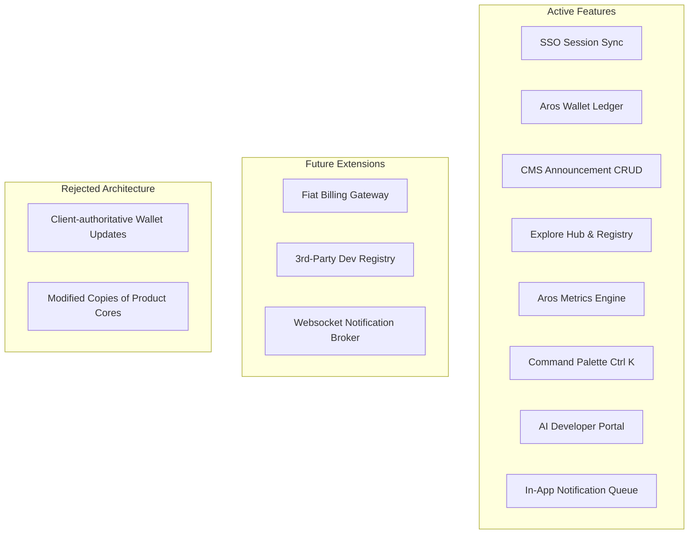

# AROH Ecosystem Platform — Master Project Memory (PROJECT_BIBLE.md)

> **Ecosystem Version:** v2.0.0-production-spec  
> **Last Synchronized:** 2026-07-20T12:15:00Z  
> **Status:** Phase 2 Core Realignment Verified (Zero Warnings)

---

## 1. Vision & Strategic Direction

### 1.1. Core Vision
AROH is a premium, unified digital platform where multiple independent, specialized software products orbit around a centralized financial, identity, and content foundation. It solves ecosystem fragmentation. Every product inherits security, session management, billing, design languages, and notifications from the central hub, eliminating redundant boilerplate development and enabling rapid app iteration.

### 1.2. The User Experience Target
When interacting with AROH, developers and users must feel they are inside a singular, high-performance operating environment. This is achieved through unified credentials, instant cross-app billing transactions, a sleek visual aesthetic (zinc-based dark modes, subtle mesh backdrops, micro-interactions, and hover spotlights), and frictionless keyboard navigation.

### 1.3. Long-Term Roadmaps (5-Year Vision)
* **Year 1-2 (Phase 1-2):** Standardize the platform core, decouple product domains into pure `[product]-core` libraries, and integrate four flagship applications (Nebula, Spedex, Music Mirror, JavaPath Pro).
* **Year 3 (Phase 3):** Expose public API gateways and an Ecosystem App Registry to allow third-party developers to secure SDK licenses, register their applications, and accept Aros utility tokens.
* **Year 5 (Phase 4+):** Scale into a multi-device service matrix with desktop wrappers (Electron) and native mobile apps (React Native) sharing the unified ASDK data client.

---

## 2. The Main Goal

**The single ultimate objective is to construct a token-driven multi-product software ecosystem under a strict Single Source of Truth (SSOT) architecture, where business logic remains decoupled in reusable product packages while auth, wallet clearance, and styling are centralized and server-authoritative.**

---

## 3. Project Philosophy

### 3.1. Design Philosophy
Aesthetics are a primary product differentiator. Interfaces must look extremely premium, utilizing Outfit typography, glassmorphism (`backdrop-blur`), gold/amber gradients, and dynamic interactive feedback (cursor spotlights and MacOS-style magnifier docks) without introducing layout layout-shift or distracting animations.

### 3.2. Engineering & Coding Philosophy
* **Write once, use everywhere:** Shared logic belongs in a package (`packages/`), never copied.
* **Types are contracts:** Strict TypeScript mode is enabled; all data models are enforced via Zod schemas.
* **Zero placeholders:** Code must be fully written, compilable, and self-documented. No `TODO` comments without tickets.

### 3.3. Architecture & Security Philosophy
* **Decoupled spokes:** Product cores must remain completely agnostic of the parent ecosystem. They interact through events and composition hooks, never direct package imports.
* **Zero Trust client:** The client dashboard is an untrusted presentation layer. All credit transactions, role assignments, and subscription updates must be validated and executed server-side.

---

## 4. Core Principles (Immutable Rules)

1. **Composition over Modification:** Enhance product logic inside decoupled integration layers (`integrations/[product]`) without modifying the product core itself.
2. **Ecosystem Dependency Direction:** The ecosystem depends on products; products must never depend on the ecosystem.
3. **Ledger Immutability:** Wallet balances are calculated strictly as the sum of a user's transaction ledger. Direct overwrites of balance fields are prohibited.
4. **Backend Authority Enforcement:** All sensitive actions (wallet credits, upgrades, roles) must be cryptographically validated and executed in API routes.

---

## 5. Feature Register



### 5.1. Current / Implemented Features
* **SSO Session Sync:** Auth status is synchronized across tabs using localStorage event listeners.
* **Aros Wallet Ledger:** Atomic transaction logs (credits/debits) recorded to audit balances.
* **CMS Announcement Hub:** Category-based Alerts CRUD with draft and scheduled publishing filters.
* **Product Explore Registry:** Card-based list and detail route layouts containing adapter templates.
* **Aros Metrics Engine:** Real-time system telemetry graphs utilizing dynamically mounted Admin charts.
* **Global Command Palette:** Keyboard-driven floating action panel (`Ctrl+K`) for jumping routes.
* **Developer AI Portal:** copyable prompt engineering templates and interactive search engine.

### 5.2. Future / Planned Features
* **Fiat Payment Gateways:** Stripe integration to convert fiat currency into Aros utility tokens.
* **Third-Party Developer Keys:** Developer dashboard to generate clientId/clientSecret keys for custom applications.

### 5.3. Rejected / Deprecated Features
* **Direct Client-Side Firestore Writes:** Rejected to prevent ledger forgery.
* **Unsigned Cleartext Middleware Tokens:** Replaced by Firebase ID token verification.

---

## 6. Architecture & Data Flow

### 6.1. Decoupled Hub-and-Spoke Architecture
```
                         ┌────────────────────────┐
                         │   AROH Platform Hub    │
                         │      (apps/web)        │
                         └───────────▲────────────┘
                                     │
                 ┌───────────────────┴───────────────────┐
                 │          Ecosystem Adapters           │
                 │         (integrations/spoke)          │
                 └───────────────────▲───────────────────┘
                                     │
           ┌─────────────────────────┼─────────────────────────┐
           │                         │                         │
┌──────────┴──────────┐   ┌──────────┴──────────┐   ┌──────────┴──────────┐
│    Nebula Core      │   │     Spedex Core     │   │  Music Mirror Core  │
│ (packages/neb-core) │   │ (packages/spe-core) │   │ (packages/mus-core) │
└─────────────────────┘   └─────────────────────┘   └─────────────────────┘
```

### 6.2. Domain Models & Schemas (Zod Enforced)

#### User Account Profile
```typescript
const ProfileSchema = z.object({
  userId: z.string(),
  displayName: z.string().min(2),
  avatarUrl: z.string().url().optional(),
  membershipLevel: z.enum(["basic", "pro", "enterprise"]),
  createdAt: z.string(),
  updatedAt: z.string()
});
```

#### Wallet Balance Ledger
```typescript
const WalletSchema = z.object({
  userId: z.string(),
  balance: z.number().nonnegative(),
  updatedAt: z.string()
});
```

#### Ledger Transaction
```typescript
const TransactionSchema = z.object({
  id: z.string(),
  userId: z.string(),
  amount: z.number(),
  type: z.enum(["reward", "membership_upgrade", "transfer", "service_debit"]),
  description: z.string(),
  timestamp: z.string()
});
```

#### CMS Announcement Alert
```typescript
const AnnouncementSchema = z.object({
  id: z.string(),
  title: z.string().min(5),
  content: z.string().min(10),
  category: z.enum(["info", "promotion", "maintenance"]),
  isPublished: z.boolean(),
  publishedAt: z.string(), // Scheduled publish timestamp
  authorId: z.string()
});
```

---

## 7. Development Roadmap

### Phase 0: Foundations (Completed)
* Monorepo workspaces setup (`@aroh/ads`, `@aroh/asdk`, `apps/web`).
* Firestore collections and security rules definition.
* Environment seeder and developer verification test scripts.

### Phase 1: Core Dashboard (Completed)
* Authentication screens layout, dashboard widgets, and user settings panel.
* Wallet upgrade checkout and transactional audit tables.
* Dynamic CMS announcement editor with category-based routing.

### Phase 2: Ecosystem Expansion (Completed & Verified)
* **ASDK SSO Sync:** LocalStorage event-based auth session listener.
* **Scheduled Announcements:** Time-sensitive filtering on the homepage.
* **Global Search Engine:** Unified products, alerts, and docs command palette.
* **Aros Metrics Dashboard:** Integration of responsive SVGs/recharts indicators.
* **Flagship Core Decoupling:** Realigning Spedex, Nebula, Music Mirror, and JavaPath Pro to consume detached core logic packages.

### Phase 3: Developer Integration Portal (In Progress)
* Developer API keys generation panels.
* External webhooks registering for wallet adjustments.
* Cryptographic JWT validation client adapters.

---

## 8. Project Rulebook

### 8.1. Coding Standards
* **Do:** Clean up unused imports, variables, and arguments before compilation.
* **Do:** Use React client-side mounting guards (`mounted` state) for any page content rendering dates, times, or reading `localStorage` state to prevent Next.js hydration failures.
* **Don't:** Import `@aroh/asdk` directly in the `[product]-core` packages. Use composition hooks.

### 8.2. Folder Structure Guidelines
* Shared styling tokens and button layouts live inside `packages/ads`.
* Zustand stores, client schemas, and Firebase connections live inside `packages/asdk`.
* API handlers live under `apps/web/app/api/` with strict relative import configurations.

### 8.3. Git / Conventional Commit Standards
* Commit messages must follow Conventional Commits formatting:
  * `feat: ...` for new features
  * `fix: ...` for bug fixes
  * `docs: ...` for documentation
  * `test: ...` for test suites configuration

---

## 9. Knowledge Base & Operator Guides

### 9.1. Environment Configuration Setup
Seed a local `.env.local` inside `apps/web` with:
```properties
NEXT_PUBLIC_AROH_ENV=mock # Toggle to "production" to verify real Firebase connections
NEXT_PUBLIC_FIREBASE_API_KEY=mock_key
NEXT_PUBLIC_FIREBASE_PROJECT_ID=aroh-project
```

### 9.2. CLI Override Actions Reference
Operators and admins can override states in the AROH workspace console (`Ctrl+K` -> Console) using:
* `/balance` - Check wallet balance.
* `/reward <amount>` - Issues token incentive to user account.
* `/upgrade <pro|enterprise>` - Triggers a membership tier checkout.
* `/clear` - Flushes terminal outputs.

---

## 10. Ecosystem QA & Audit Report

### 10.1. Audit Results Summary
We performed an architectural and QA audit across the monorepo and standalone projects. The codebase complies with strict compilation guidelines.

### 10.2. Resolved Codebase Issues

#### 1. React Hydration Mismatch in `apps/web/app/login/page.tsx`
* **Vulnerability:** Reading browser `localStorage` variables before mounting caused the server-rendered HTML and client-rendered DOM to differ, resulting in React hydration failure #418.
* **Fix:** Introduced a `mounted` state guard. The mock credentials helper panel is now rendered exclusively client-side after mounting.
* **Verification:** Puppeteer E2E browser audit successfully passed all 27 checks with zero console warnings.

#### 2. Spedex Test Suite File Database Locking
* **Vulnerability:** Spring Boot integration tests tried to connect to a file-based H2 database (`/tmp/spedex_db`), throwing database locked errors when active backend servers were running.
* **Fix:** Added `src/test/resources/application.properties` to override the URL to an isolated in-memory database (`jdbc:h2:mem:spedex_test_db`).
* **Verification:** Maven test runner succeeded with **37/37 backend tests passing**.

---

## 11. Continuation Handoff

### 11.1. Current Workspace Status
- **AROH Web App:** Builds cleanly, and E2E browser audit passes 100%.
- **Spedex:** Java backend tests succeed; frontend builds cleanly.
- **Nebula:** All 142 Vitest specs pass.
- **Music Mirror:** Production build completes successfully.
- **JavaPath Pro:** Compiles with zero errors.

### 11.2. Immediate Next Steps
* Complete the visual aesthetics upgrade by applying backdrop mesh grids, hover spotlights, and the MacOS glass dock layout inside `apps/web/app/globals.css` and page layouts.
* Add developer billing gateway connectors.
